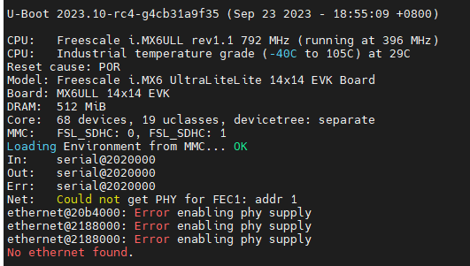
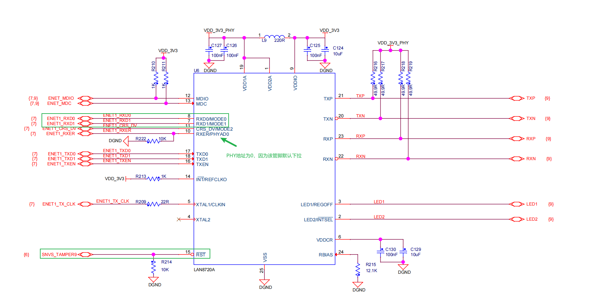
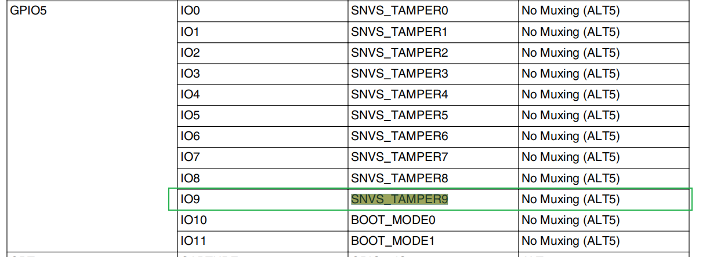

# 100ASK_IMX6ULL_MINI u-boot ETH驱动适配
网上有很多这块板子的u-boot ETH驱动移植经验帖，但时候好像没有（至少我没有找到）从头到尾将这件事讲完整的。这篇文章将试图把整个流程讲清楚，方便初学者入门，能够一通百通。

## 起源
可能刚拿到板子的同学会比较困惑，开发板厂家提供的SDK和u-boot主干有什么不同呢？厂家到底做了哪些修改？为了回答这个问题，我们先说下芯片公司、厂家和用户三者的关系：
* 芯片公司移植的 u-boot 从一开始是基于官方的 u-boot 拿来修改。添加/修改自家的 EVK 评估版的板子型号、相关外设初始化文件，并修改 u-boot 的 Makefile 配置，然后把自家芯片的 EVK 评估版的硬件原理图、u-boot、Linux 和 根文件系统以及使用说明文档等等全部开源，以供下游做应用的公司/厂家和做开发板的公司拿来做修改或直接应用；
* 做开发板的厂家在拿到了芯片公司提供的芯片评估版 EVK 板子的原理图后，与 SoC 直接相关的比如 PMIC、DDR、FLASH、以太网 PHY 芯片等等不会做大改，一般直接照搬过来画自己的开发板。因为在移植 u-boot 的时候就不用再为新选型的芯片做代码适配，一般没必要做这种费力但效果不大的事情，能直接用的就尽量直接用，能不用改的就尽量不改。然后再拿到芯片公司提供的芯片评估版 EVK 板子对应的 u-boot 源码之后，同样的再添加/修改为自家开发板的型号、添加一点点自己板子的外设初始化代码（这个要求比较高）并修改 Makefile，便得到自家开发板适配的又一个 u-boot；
* 当用户（比如现在的我）拿到了开发板厂家 或者 芯片公司提供的 u-boot 源码，即所有相关文件和初始化代码都写好了，便可以直接编译进而使用，或者自己再进一步定制化。

因此，我们现在想从u-boot主干适配我们的板子，其实就是在干开发板厂家做的事情。通过以上介绍，我们至少对自己当前所处的位置有了一定概念。

## 交叉编译 - 工欲善其事必先利其器
熟悉嵌入式软件开发的同学一定知道什么是交叉编译。这边我就大概讲一下其原理。C程序都是编译、链接后才能得到bin然后被cpu执行，编译、链接的动作是由编译器、链接器完成的。以前我们刚学C语言的时候，编译出来的bin直接在本机上可以运行，这是因为本机上的编译器和本机的cpu架构是匹配的。而现在我们想在x86架构的cpu上编译C代码，将编译出来的bin放到例如armv7架构的cpu上运行，这就需要交叉编译。**说白了，交叉编译其实就是一个翻译工具，这个工具本身是在A架构的CPU上运行的。现在用这个翻译工具将代码翻译为能够在B架构CPU上运行的程序。**

[安装交叉编译器的方法](https://blog.csdn.net/qq_36347513/article/details/126658866)
## 使用u-boot主干config
首先我们使用u-boot主干上最接近我们板子的配置来编译u-boot版本，看看会有哪些问题，是否能够正常启动。
```
make distclean
make mx6ull_14x14_evk_defconfig
make -j8
```
编译得到\

## 添加自己的板子
[linux驱动之系统移植-----官方uboot添加自定义板子](https://blog.csdn.net/qq_40684669/article/details/128428623)

## 根据硬件修改配置
设备树里主要定义的引脚相关的信息，我们需要将原理图和设备树对应起来。可以看到，我们仅需修改`ENET_MDIO`、`ENET_MDC`、`SNVS_TAMPER9`三个管脚。
1. 首先是修改管脚复用，查看硬件原理图：

将原理图中的引脚和现有设备树中引脚比对，发现有三个引脚需要修改，分别为`ENET_MDIO`、`ENET_MDC`、`SNVS_TAMPER9`。其中`ENET_MDIO`、`ENET_MDC`比较好办，原理图中直接标明了它们是由哪个引脚mux来的：\
\
于是我们在设备树中添加[配置](https://github.com/u-boot/u-boot/compare/master...jd-you:u-boot:port_uboot?diff=unified#diff-f7b1aa2dc58bd89ff34eee941be9d34a338679e86fb542a7d1997e30ae25b04cR419-R420)，将GPIO1-6和GPIO1-7复用为`ENET_MDIO`和`ENET_MDC`。接着是`SNVS_TAMPER9`管脚，这个管脚对应的GPIO管脚在原理图中找不到，我们直接到芯片手册中查找：
\
`SNVS_TAMPER9`对应的是GPIO5-9，所以在设备树中添加下列[配置](https://github.com/u-boot/u-boot/compare/master...jd-you:u-boot:port_uboot?diff=unified#diff-f7b1aa2dc58bd89ff34eee941be9d34a338679e86fb542a7d1997e30ae25b04cR429)。
2. 第二步需要根据实际使用的ETH口，将[`fec2` Disable掉](https://github.com/u-boot/u-boot/compare/master...jd-you:u-boot:port_uboot?diff=unified#diff-f7b1aa2dc58bd89ff34eee941be9d34a338679e86fb542a7d1997e30ae25b04cR195)，同时[Enable `fec1`](https://github.com/u-boot/u-boot/compare/master...jd-you:u-boot:port_uboot?diff=unified#diff-f7b1aa2dc58bd89ff34eee941be9d34a338679e86fb542a7d1997e30ae25b04cR186)。此外，我们需要给`fec`[新增复位属性](https://github.com/u-boot/u-boot/compare/master...jd-you:u-boot:port_uboot?diff=unified#diff-f7b1aa2dc58bd89ff34eee941be9d34a338679e86fb542a7d1997e30ae25b04cR184-R185)。最后，根据`PHYAD0`管脚的上下拉状态，确定phy addr。在我们的板子上，由于管脚是下拉的，所以phy addr为0，相应的[配置](https://github.com/u-boot/u-boot/compare/master...jd-you:u-boot:port_uboot?diff=unified#diff-f7b1aa2dc58bd89ff34eee941be9d34a338679e86fb542a7d1997e30ae25b04cR201-R203)。
3. 最后一步，是网上很多教程中都没有做的一步，就是[修改Config头文件](https://github.com/u-boot/u-boot/compare/master...jd-you:u-boot:port_uboot?diff=unified#diff-393a070827ce3f7e6aa14877dc2f29414c9b555b23e9eaa1239a697fb6d4afcaR112)。由于我们用的设备是ETH0，所以应将此配置修改为0。否则网卡无法正常驱动。

修改完成后，可以发现ETH仍然不通，经过走读代码发现，在`include/configs/my_mx6ullevk.h`中需要将`CFG_FEC_ENET_DEV`修改为0，因为我们用了ETH1。

接着启动板子，设置好MAC地址和IP地址后，网络可以正常ping通。但还有个美中不足的地方就是u-boot启动时的打印信息没了（例如版本号、编译时间、CPU信息等）。为了解决此问题，需要新建一个`arch/arm/dts/my_imx6ull-14x14-evk-u-boot.dtsi`，并将原文件的内容拷过来即可解决。